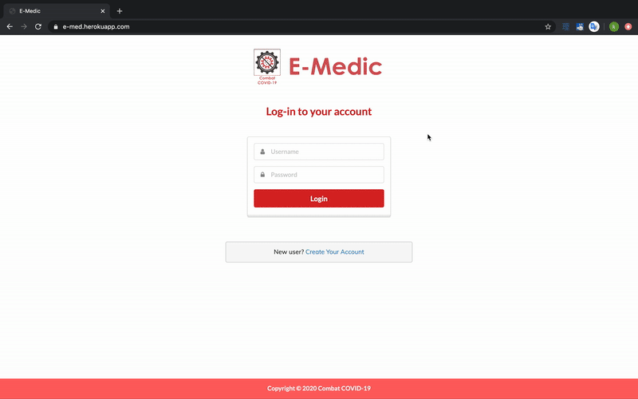
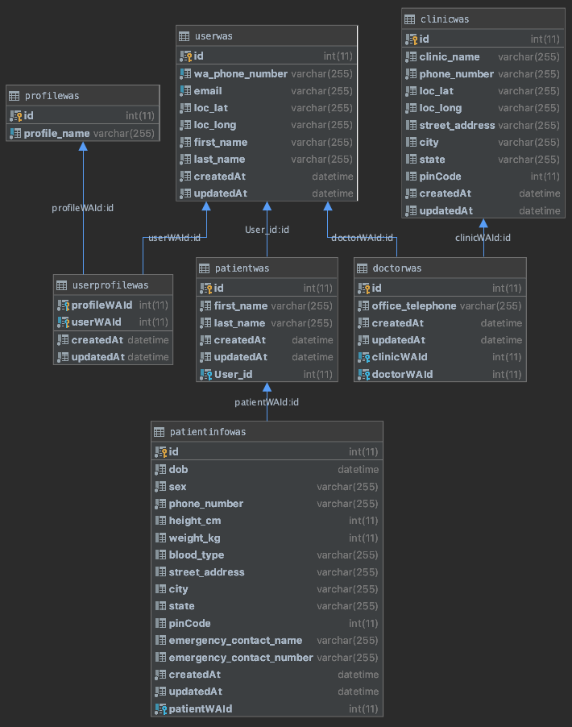

# E-Medic

Making Telemedicine Accessible - Accelerating the reach of primary healthcare in the post-Covid19 India

    

### Overview

E-Medic is primarily a WhatsApp chatbot with an integrated web application for facilitating online consultations
and zero-contact physical hospital visits.

### Demo - Whatsapp

### Demo - Webapp

### Collaborators

* Kunal Jain - [@kj7kunal](https://github.com/kj7kunal)
* Nirmaan Sarkar - [@pikujs](https://github.com/pikujs)

### Models Structure - Whatsapp

### Models Structure - Webapp

# Packages Used

* [Node.JS](https://www.npmjs.com/)
* [MySQL2](https://www.npmjs.com/package/mysql2)
* [Express](https://www.npmjs.com/package/express)
* [Sequelize](http://docs.sequelizejs.com/)
* [Sequelize-fixtures](https://www.npmjs.com/package/sequelize-fixtures)
* [Socket.io](https://www.npmjs.com/package/socket.io)
* [Passport](https://www.npmjs.com/package/passport)
* [bcrypt](https://www.npmjs.com/package/bcrypt)
* [Chart.js](https://www.npmjs.com/package/chart.js)
* [Handlebars](https://www.npmjs.com/package/express-handlebars)
* [Helper-Moment](https://www.npmjs.com/package/helper-moment)
* [Heroku](https://www.npmjs.com/package/heroku)

# History

Version 0.0.1 (07/14/20)

    

